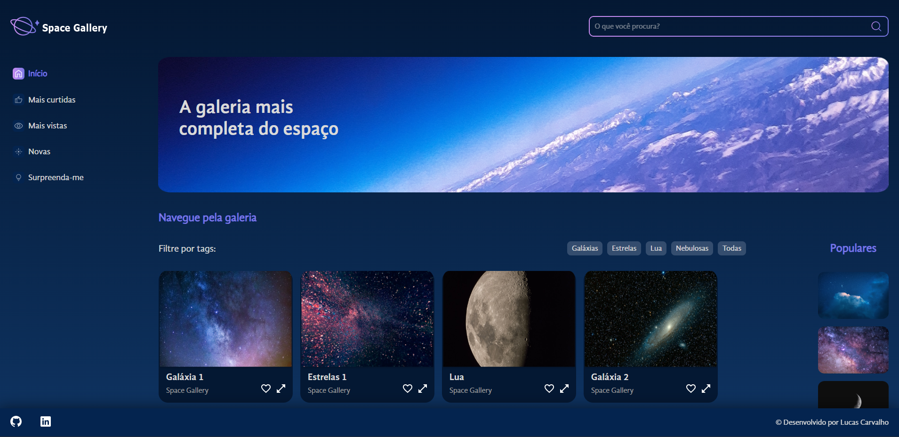

<h1 align="center">Space Gallery</h1>

## Descrição e objetivo do projeto

O Space Gallery é uma galeria de fotos do espaço.

O objetivo foi criar uma aplicação com React.JS, separando cada parte da UI em um componente.

Adicionando funcionalidades, como por exemplo, filtrar a exibição das imagens por tags.

Utilizando a importação de arquivos estáticos, como imagens, arquivos CSS ou SCSS, fontes, HTML semântico e boas práticas do React.

## :heavy_check_mark: Tecnologias utilizadas

- `React`
- `SCSS`
- `JavaScript`

## :link: Acesso ao projeto

Você pode acessar o deploy do projeto na Vercel clicando [aqui](https://space-gallery-gold.vercel.app/).
